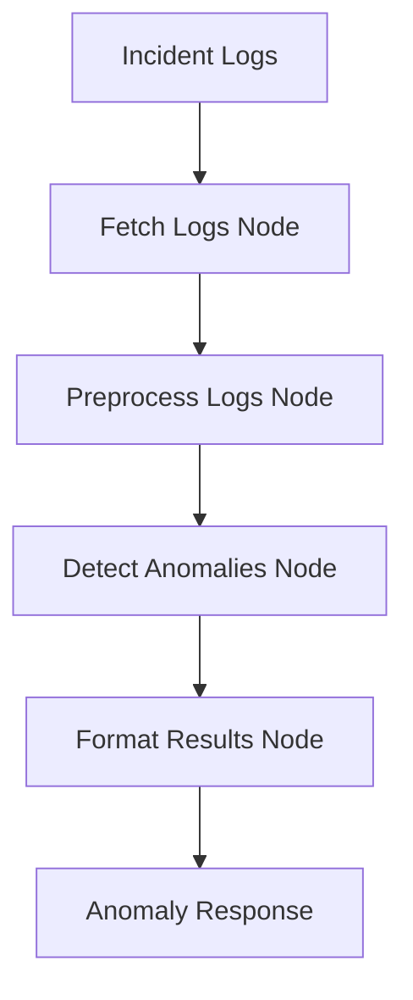

# Anomaly Detection Agent

ML-powered anomaly detection service for incident logs using FastAPI and LangGraph.

## 🎯 Purpose

This service analyzes incident logs stored in Valkey/Redis and detects anomalies using machine learning techniques (Isolation Forest) and statistical methods. It's part of the incident management pipeline that helps identify unusual patterns in system behavior.

## 🏗️ Architecture

- **FastAPI**: Web framework for REST API endpoints
- **LangGraph**: Workflow orchestration for anomaly detection pipeline
- **Scikit-learn**: Machine learning library for Isolation Forest algorithm
- **Redis/Valkey**: Data store for incident logs
- **Docker**: Containerized deployment

## 🔄 Workflow



## 📡 API Endpoints

### Health Check
```bash
GET /health
```

### Detect Anomalies
```bash
POST /detect-anomalies
Content-Type: application/json

{
  "incident_id": "bugraid-INC-6825",
  "time_window_hours": 24,
  "confidence_threshold": 0.7
}
```

**Response:**
```json
{
  "incident_id": "bugraid-INC-6825",
  "anomalies_detected": 3,
  "anomalies": [
    {
      "log_index": 42,
      "timestamp": "2025-09-19T07:49:29Z",
      "level": "ERROR",
      "message": "Database connection timeout after 30s",
      "service": "user-service",
      "confidence": 0.85,
      "anomaly_type": "performance",
      "features": {
        "message_length": 45,
        "error_keywords": 2,
        "level_severity": 4,
        "response_time": 30000,
        "memory_usage": 0
      }
    }
  ],
  "processed_logs": 150,
  "analysis_timestamp": "2025-09-19T07:49:30Z"
}
```

## 🔧 Configuration

### Environment Variables

| Variable | Description | Default |
|----------|-------------|---------|
| `VALKEY_HOST` | Valkey/Redis host | `valkey-store-dev-zizz73.serverless.apse1.cache.amazonaws.com` |
| `VALKEY_PORT` | Valkey/Redis port | `6379` |
| `VALKEY_USERNAME` | Valkey username | `chunking-lambda-valkey-read` |
| `VALKEY_PASSWORD` | Valkey password | Required |
| `ENVIRONMENT` | Deployment environment | `development` |

## 🚀 Deployment

### Docker Build
```bash
docker build -t anomaly-detection-service .
```

### Local Run
```bash
docker run -p 8000:8000 \
  -e VALKEY_HOST=your-valkey-host \
  -e VALKEY_PASSWORD=your-password \
  anomaly-detection-service
```

### ECS Deployment
```bash
# Register task definition
aws ecs register-task-definition --cli-input-json file://anomaly-task-definition.json

# Create service
aws ecs create-service \
  --cluster your-cluster \
  --service-name anomaly-detection-service \
  --task-definition anomaly-detection-service \
  --desired-count 1
```

## 🧠 Machine Learning Features

### Feature Extraction
- **Message Length**: Length of log message
- **Error Keywords**: Count of error-related keywords
- **Level Severity**: Numeric severity (DEBUG=1, INFO=2, WARNING=3, ERROR=4, CRITICAL=5)
- **Response Time**: Request/response time if available
- **Memory Usage**: Memory utilization if available

### Anomaly Detection
- **Algorithm**: Isolation Forest
- **Contamination**: 10% (assumes 10% of logs are anomalies)
- **Confidence Threshold**: Configurable (default 0.7)

### Anomaly Types
- **Performance**: High response times, timeouts
- **Memory**: High memory usage, memory leaks
- **Error**: Exception patterns, critical errors
- **Pattern**: Unusual message patterns or lengths

## 📊 Monitoring

### Health Check
The service provides a health endpoint that checks:
- Service status
- Valkey connectivity
- Current timestamp

### Logging
- Structured logging with timestamps
- Request/response logging
- Error tracking and debugging

### Metrics
- Anomalies detected per incident
- Processing time per request
- Log volume processed

## 🔍 Example Usage

```python
import httpx

async def detect_anomalies(incident_id: str):
    async with httpx.AsyncClient() as client:
        response = await client.post(
            "http://anomaly-service:8000/detect-anomalies",
            json={
                "incident_id": incident_id,
                "time_window_hours": 24,
                "confidence_threshold": 0.8
            }
        )
        return response.json()

# Usage
anomalies = await detect_anomalies("bugraid-INC-6825")
print(f"Found {anomalies['anomalies_detected']} anomalies")
```

## 🛠️ Development

### Requirements
- Python 3.11+
- Redis/Valkey instance
- Docker (for containerization)

### Local Development
```bash
# Install dependencies
pip install -r requirements.txt

# Run locally
python anomaly_detection_service.py

# Test endpoint
curl -X POST http://localhost:8000/detect-anomalies \
  -H "Content-Type: application/json" \
  -d '{"incident_id": "test-incident"}'
```

### Testing
```bash
# Health check
curl http://localhost:8000/health

# Anomaly detection test
curl -X POST http://localhost:8000/detect-anomalies \
  -H "Content-Type: application/json" \
  -d '{
    "incident_id": "bugraid-INC-6825",
    "time_window_hours": 24,
    "confidence_threshold": 0.7
  }'
```

## 📈 Performance

- **CPU**: 1024 units (1 vCPU)
- **Memory**: 2048 MB (2 GB)
- **Processing**: ~100-500 logs per second
- **Latency**: <2 seconds for typical incident analysis

## 🔐 Security

- Environment-based configuration
- No hardcoded credentials
- Secure Redis/Valkey connections
- Container isolation

## 📝 License

MIT License - See LICENSE file for details.
